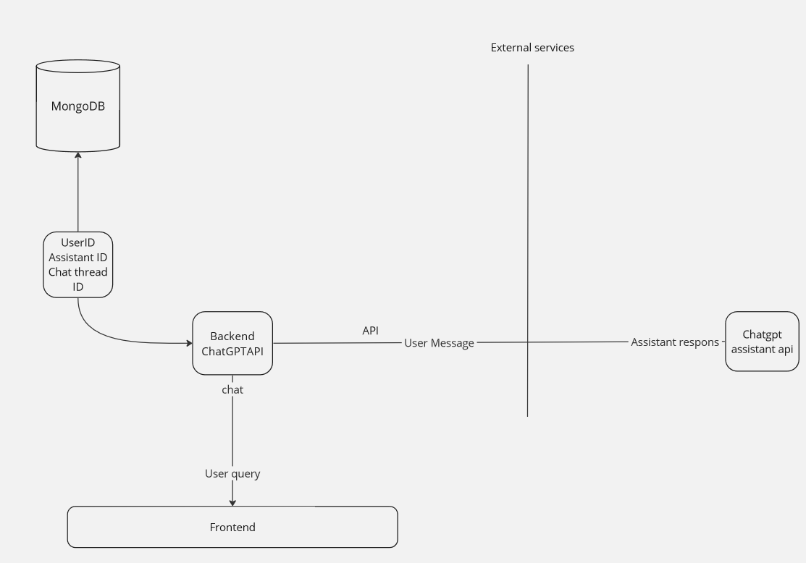

# Developer Guide for scAIentific: AI-powered Research Front Analyzer

This document provides a comprehensive guide for developers working on the scAIentific project, detailing architecture, APIs, databases, servers, version control, development environments, code standards, and how to get started with development. It also covers learning new techniques, testing, and plans for future iterations.

## Features

- **Article Upload**: Users can upload files up to 512 MB directly into the AI assistant.
- **Custom AI-Assistant Creation**: Allows users to create a personalized AI assistant. This specialized assistant is proficient in a research field specified by the user.
- **Research Discussion with the AI-Assistant**: Offers the capability to converse with the assistant and discuss the file's content, assisting in the identification of the research front.

## Architecture and Design

scAIentific's architecture is designed to facilitate efficient analysis of scientific texts, leveraging AI to identify research trends.



## APIs, Databases, Servers, and Services

### APIs

- `/generateByFile`: Endpoint for creating an assistant with a thread, and upload a file to it.
- `/assistant-chat`: Endpoint for real-time communication with the AI-assistant.

We utilize the OpenAI Assistant API for AI interactions

### databases

- MongoDB (will be added in the next iteration).

### Servers

Our servers, essential for hosting and executing the application, are going to be deployed on Azure, ensuring scalable and reliable service.

### Services  

(Are implemented but will be deployed soon)

#### ChatGPT Microservice

Our application incorporates the ChatGPT microservice as a core component, responsible for managing communication with the OpenAI Assistant. This microservice acts as an intermediary, ensuring efficient and reliable information transfer between the OpenAI API and our frontend. It is designed to process and serve AI-generated insights, facilitating seamless interaction within the scAIentific platform.

- **Functionality**: The ChatGPT microservice handles requests from the frontend, queries the OpenAI Assistant API for information or analysis, and then formats and returns the response to the user interface. This includes creating an assistant, uploading files, and supporting real-time discussions with the AI assistant.
  
- **Technology Stack**: Developed with C# and .NET.
  
## Version Control Instructions

Version control is managed through Git, with a focus on feature branching and pull requests to ensure code quality and facilitate collaborative development.
The merge request is applied upon consensus approval.

## Development Environments

Developers are encouraged to use Visual Studio or Visual Studio Code, equipped with the .NET SDK, to work on the scAIentific project.

## Code Standards

We adhere to standard coding practices for .NET and C#, with static code analysis tools integrated to maintain code quality. Developers are expected to follow these standards to ensure consistency and readability across the codebase.

## Setting Up the Development Environment

To get the development environment up and running:

1. Clone the repository.
2. Install required dependencies.
3. Follow the setup instructions detailed in the `Getting Started` section of this document.

## Getting Started

### Prerequisites

- .NET core 7 an above.  
- An IDE such as Visual Studio or Visual Studio Code
- Access to the provided AI model or equivalent

### Setup

1. Clone the repository to your local machine.
2. Ensure all required software and dependencies are installed.
3. Navigate to the project directory and restore the required packages:

```shell
dotnet restore
```

4. Start the backend server:

```shell
dotnet run --project Path/To/ChatGPTAPI
```

5. Start the frontend application:

```shell
cd Path/To/Frontend
dotnet run
```

## Usage

- Navigate to the frontend application through your web browser.
- Follow the UI prompts to upload your scientific texts and receive the analysis.

## Learning New Techniques ????

?
Link to tutorials?

## Testing Strategy  

Our comprehensive testing strategy is designed to ensure both the technical robustness of the scAIentific platform and the effectiveness of the AI-driven functionalities it offers. It is divided into two main components: User Feedback Testing and Code Testing.

### User Feedback Testing

To refine and enhance the AI assistant's ability to analyze and discuss scientific articles, we rely heavily on user feedback. This iterative process involves:

- **Pilot User Program**: The main costumer will be given an early access to the scAIentific application to use its features in real-world research scenarios.
- **Feedback Collection**: the costumer will provide detailed feedback on his interactions with the AI assistant, especially regarding the relevance and clarity of its responses and the usability of the interface for uploading documents and creating custom AI assistants.
- **Prompt Improvement**: Based on The costumer feedback, our team will iteratively improve the AI prompts and the underlying logic of the AI assistant to better meet the needs of our users. This includes tuning the AI's response generation to ensure more accurate, relevant, and helpful interactions.

### Code Testing

To ensure the application's reliability and functionality, our development process incorporates extensive code testing, including:

- **Unit Testing**: Individual units of source code are tested for correctness. This helps in identifying early bugs in the development cycle.
- **Manual Testing**: In addition to automated tests, manual testing is going to be conducted to ensure that the user interface and user experience meet our quality standards. This will involve realistic user scenarios to test the application's end-to-end capabilities.
- **Continuous Integration (CI)**: As soon we have access to the deployment environment  .


### Future Testing Improvements

For future iterations, we plan to introduce:

- **Automated UI Testing**: Implementing automated tests for the user interface to further ensure application reliability and user satisfaction.
- **Performance Testing**: Conducting tests to assess the application's performance under various conditions, ensuring scalability and responsiveness.

By combining user feedback with rigorous code testing, we aim to continuously improve scAIentific, making it more effective and user-friendly with each iteration. Our goal is to provide a robust platform that meets the evolving needs of researchers and students in the scientific community.

## Upcoming Features in the Next Iteration

- **Personalized Email Summaries**: The ability to save discussions and send them directly to the user's personal email.
- **Multi-User Account System**: We are planning to introduce a login system to support multiple users and personal user accounts.  

## Future Improvements

- To be able to upload an excel file.
