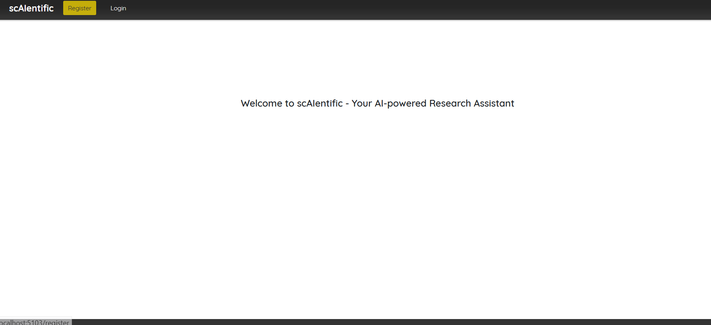

# scAIentific: AI-powered Research Front Analysis

## Overview

scAIentific is an application designed to assist researchers and students in their researches. By utilizing advanced AI algorithms, scAIentific simplifies the process of identifying key trends, themes, and findings within 250 scientific articles. This tool aims to make the exploration of the research front more efficient and accessible, saving time and resources for its users.

### Project Origin

The need for scAIentific arose from the challenges faced by researchers in summarizing extensive previous works, a task particularly daunting when writing dissertations or scientific papers. An example project examining gender differences in networking during college years highlighted the labor-intensive process of manually identifying relevant research trends from a pool of 250 scientific articles.

### Purpose

scAIentific's goal is to explore how AI can facilitate and streamline the process of research front analysis, potentially uncovering insights that manual methods might miss.

### Project Goals

- Develop a prototype/proof-of-concept application capable of compiling up to 250 articles to describe the current research front.
- Provide a user-friendly frontend for uploading articles and receiving summarized results.

## Features

- **Article Upload**: Users can import up to 250 scientific texts into the AI engine.
- **Research Summary**: Generates a summary of the submitted texts/reports.

## Technical Stack

- **Frontend**: Blazor
- **Backend**: C#, .NET

## Getting Started

### Prerequisites

- .NET SDK (version specific to project requirements)
- An IDE such as Visual Studio or Visual Studio Code
- Access to the provided AI model or equivalent

### Setup

1. Clone the repository to your local machine.
2. Ensure all required software and dependencies are installed.
3. Navigate to the project directory and restore the required packages:

```shell
dotnet restore
```

4. Start the backend server:

```shell
dotnet run --project Path/To/BackendProject
```

5. Start the frontend application:

```shell
cd Path/To/FrontendProject
dotnet run
```

## Usage

- Navigate to the frontend application through your web browser.
- Follow the UI prompts to upload your scientific texts and receive the analysis.  

## Project design
  
  
  

## License


